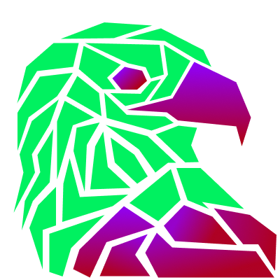
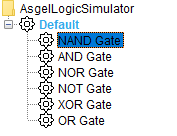
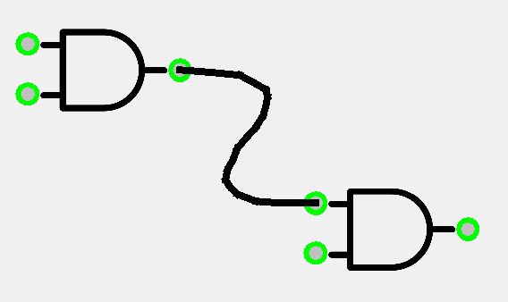
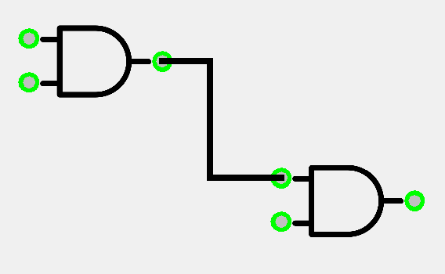

[][releases latest]

# Asgel Logic Simulator

    

This projects is intended to be an useful and efficient logic simulator. It was made at first with the intention of simulating a 8 bit computer processor, as to allow me to build it out of CMOS 4000 chips and breadboard.

## Table of contents
* [Licence](#license)
* [Bundles](#bundles)
* [Working Directory](#working-directory)
* [How to use it](#how-to-use-it)
* [Common bundles](#common-bundles)
* [Downloads](#download)
* [Acknowledgements](#acknowledgements)

## License
- (c) 2022 Florent guille
- 

## Bundles
This project works using packs of logic gates, here designated as **bundles**. Each bundle is supposedly independant from the other, and defines some gates, and tabs where to store them.  
As an example, this is the default tab from the default bundle, adding the most basic gates.  
   
 This is an example of a tab, here from the <a href= "https://github.com/AsgelTaren/AsgelLogicDefault"> Default Bundle </a>

## Working directory
This project uses a concept of working directory. In this specific directory must be placed all of the relevant files relatively to your models. This is particularly true when you went to create some models, relying on other files using relative URLs

## How to use it
### Adding an Model Object
Logic gates are denoted here as *Model Objects*. You simply need to drag a model object from the right panel and drop it in your model. For some objects, you will be asked to give some parameters related to it.
There is not that much security now about the integrity of the values you can type. If one of the parameters is invalid (Ex: Not a Number for a number parameters), there will be no object added to your model.

### Adding a Link
You can add links by clicking on a pin from an object and dragging it to the target pin. Note that pins have a type: they can be input or output. You can only connect two pins with different types.

### Turning a Link into a broken line
To turn a link into a broken line, you need to make the connected objects static, by right-clicking and uncheck the *Moveable* check box.
After that, you need to perform a middle-button click on one of the pin, and click at every point you want to add to the broken line. To complete this transformation, you need to click to the remaining pin.

Before breaking

After breaking

## Download

You can get a list of the compiled binaries in the  [release section][releases]

## Common bundles
Here is the list of the bundles that i made and used to simulate the computer

- [Asgel's Logic Default Bundle][bundle default]
- [Asgel's Logic Signal Manipulation Bundle][bundle signal]
- [Asgel's Logic CMOS Components Bundle][bundle cmos]

## Acknowledgements

Bundle icon : <a href="https://www.flaticon.com/free-icons/product" title="product icons">Product icons created by Tanah Basah - Flaticon</a>  
Close icon : <a href="https://www.flaticon.com/free-icons/close" title="close icons">Close icons created by ariefstudio - Flaticon</a>  
Export icon : <a href="https://www.flaticon.com/free-icons/export" title="export icons">Export icons created by Miftakhul Rizky - Flaticon</a>  
Logs icon : <a href="https://www.flaticon.com/free-icons/log" title="log icons">Log icons created by Smartline - Flaticon</a>  
Create file icon : <a href="https://www.flaticon.com/free-icons/paper" title="paper icons">Paper icons created by Neveraemje - Flaticon</a>  
Open file icon : <a href="https://www.flaticon.com/free-icons/folder" title="folder icons">Folder icons created by kmg design - Flaticon</a>  
Save file icon : <a href="https://www.flaticon.com/free-icons/save" title="save icons">Save icons created by Yogi Aprelliyanto - Flaticon</a>
 
 
Look in each bundle repository for bundle's acknoledgements

[bundle default]:https://github.com/AsgelTaren/AsgelLogicDefault
[bundle signal]:https://github.com/AsgelTaren/AsgelLogicSignalManip
[bundle cmos]:https://github.com/AsgelTaren/AsgelCMOS4000
[releases]:https://github.com/AsgelTaren/AsgelLogicSimulator/releases
[releases latest]:https://github.com/AsgelTaren/AsgelLogicSimulator/releases/latest
