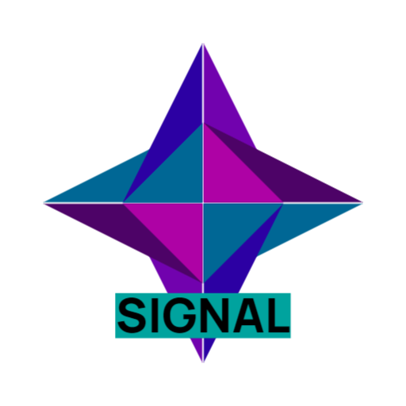
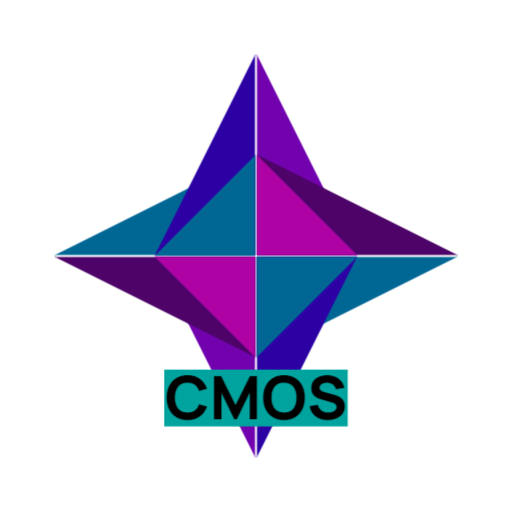

# Asgel Logic Simulator

    

    
    
AsgelLogicSimulator

    

    

This projects is intended to be an useful and efficient logic simulator. It was made at first with the intention of simulating a 8 bit computer processor, as to allow me to build it out of CMOS 4000 chips and breadboard.

## Table of contents
* [Licence](#license)
* [Bundles](#bundles)
* [How to use it](#how-to-use-it)
* [Common bundles](#common-bundles)
* [Acknowledgements](#acknowledgements)

## License
- (c) 2022 Florent guille
- 

## Bundles
This project works using bundles of logic gates, which can be selected during launch, which allow users to have an efficient way of organizing logic gates. This is being done by placing gates in tabs. One bundle can define multiple tabs and multiple gates, but these gates must be placed in one of the said bundle's tabs

 This is an example of a tab; Here from the <a href= "https://github.com/AsgelTaren/AsgelLogicDefault"> Default Bundle </a>

## Working dir
By default, this project in this development environment will use the <a>res/workingDir</a> directory as its working directory. 
 
The working directory a folder that should contain every files related to a model. For instance, if you want to use a <a>ModelBox</a>, you will need to place it inside the working directory, or at least as one of its descendent.
 
The working directory is also the folder that will be used by default when trying to save a model as a specific file. For now, you cannot change the working directory when the app is running, this will be added in a future release.
A config file stores your last working directory, to allow users to quickly select them.

## How to use it
### Adding an Model Object
Logic gates are denoted here as *Model Objects*. You simply need to drag a model object from the right panel and drop it in your model. For some objects, you will be asked to give some parameters related to it.
There is not that much security now about the integrity of the values you can type. If one of the parameters is invalid (Ex: Not a Number for a number parameters), there will be no object added to your model.

### Adding a Link
You can add links by clicking on a pin from an object and dragging it to the target pin. Note that pins have a type: they can be input or output. You can only connect two pins with different types.

### Turning a Link into a broken line
To turn a link into a broken line, you need to make the connected objects static, by right-clicking and uncheck the *Moveable* check box.
After that, you need to perform a middle-button click on one of the pin, and click at every point you want to add to the broken line. To complete this transformation, you need to click to the remaining pin.

Before breaking

After breaking

## Download

You can download an executable and some common bundles that i used with this <a href="https://www.mediafire.com/file/zyjl24q63pt83xe/AsgelLogicSimulator-v0.0.rar/file">link</a>

## Common bundles
Here is the list of the bundles that i used to simulate the computer

<a style = "font-weight:900" href="https://github.com/AsgelTaren/AsgelLogicDefault">Asgel Logic Default</a>

<a style = "font-weight:900" href="https://github.com/AsgelTaren/AsgelLogicSignalManip">Asgel Signal Manip</a>

<a style = "font-weight:900" href="https://github.com/AsgelTaren/AsgelCMOS4000">Asgel CMOS 4000</a>

## Acknowledgements

Bundle icon : <a href="https://www.flaticon.com/free-icons/product" title="product icons">Product icons created by Tanah Basah - Flaticon</a>  
Close icon : <a href="https://www.flaticon.com/free-icons/close" title="close icons">Close icons created by ariefstudio - Flaticon</a>  
Export icon : <a href="https://www.flaticon.com/free-icons/export" title="export icons">Export icons created by Miftakhul Rizky - Flaticon</a>  
Logs icon : <a href="https://www.flaticon.com/free-icons/log" title="log icons">Log icons created by Smartline - Flaticon</a>  
Create file icon : <a href="https://www.flaticon.com/free-icons/paper" title="paper icons">Paper icons created by Neveraemje - Flaticon</a>  
Open file icon : <a href="https://www.flaticon.com/free-icons/folder" title="folder icons">Folder icons created by kmg design - Flaticon</a>  
Save file icon : <a href="https://www.flaticon.com/free-icons/save" title="save icons">Save icons created by Yogi Aprelliyanto - Flaticon</a>
 
 
Look in each bundle repository for bundle's acknoledgements
